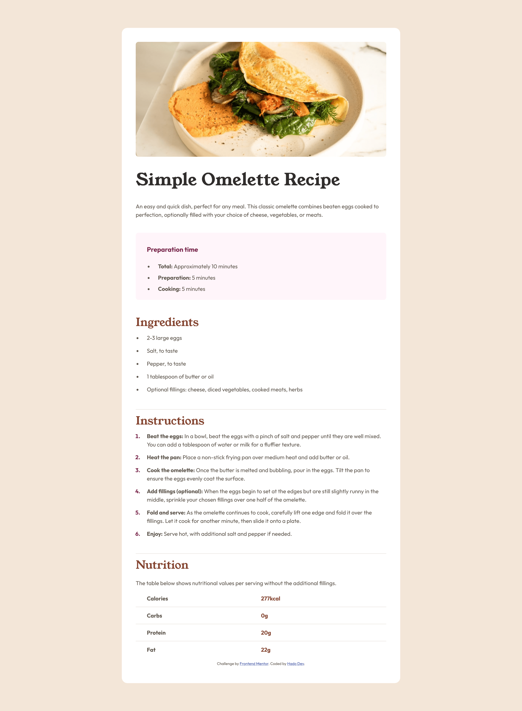
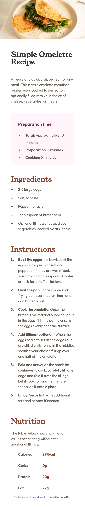

# Frontend Mentor - Recipe page solution

This is a solution to the [Recipe page challenge on Frontend Mentor](https://www.frontendmentor.io/challenges/recipe-page-KiTsR8QQKm). Frontend Mentor challenges help you improve your coding skills by building realistic projects. 

## Table of contents

- [Overview](#overview)
  - [Screenshot](#screenshot)
  - [Links](#links)
- [My process](#my-process)
  - [Built with](#built-with)
  - [What I learned](#what-i-learned)
- [Author](#author)
- [Acknowledgments](#acknowledgments)

## Overview

### Screenshot

### Links

- Solution URL: https://github.com/hadodev/RecipePage.git
- Live Site URL: https://hadodev-frontendmentor-recipepage.netlify.app

## My process

### Built with

- Semantic HTML5 markup
- Vanilla CSS
- Custom properties for colors and breakpoints
- CSS basic reset
- CSS Grid for body tag
- Use of media queries for mobile design

### What I learned

It's been an interesting projects which allowed me to reinforce the CSS and HTML concepts. 

## Author

- Website - Hado Dev (https://github.com/hadodev)
- Frontend Mentor - [@hadodev](https://www.frontendmentor.io/profile/hadodev)

## Acknowledgments

For all authors who publish open source ressources and contents freely available and make Internet more awesome.